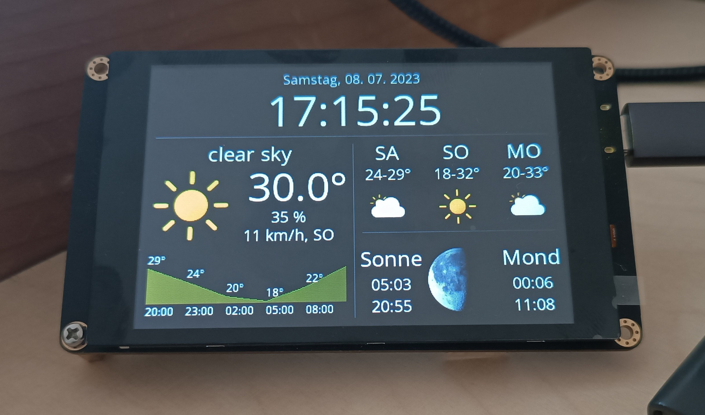

# Weather Station for Color Kit Grande and ESP32 TouchDown

Weather station application for the [ThingPulse Color Kit Grande](https://thingpulse.com/product/esp32-wifi-color-display-kit-grande/) and the [ESP32 TouchDown](https://github.com/DustinWatts/esp32-touchdown).

## Exemplary Variations

### ESP32 TouchDown (landscape mode)

### Color Kit Grande (portrait mode)

## How to use it

See the documentation at https://docs.thingpulse.com/guides/esp32-color-kit-grande/.

## Service level promise

<table><tr><td>
</td><td>This is a ThingPulse <em>prime</em> project. See our <a href="https://thingpulse.com/about/open-source-commitment/">open-source commitment declaration</a> for what this means.</td></tr></table>
